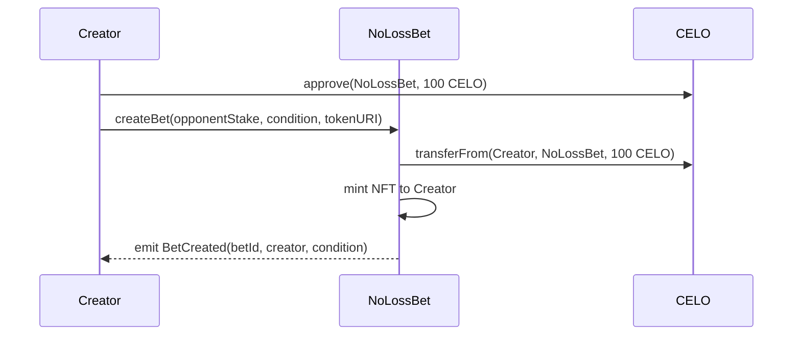
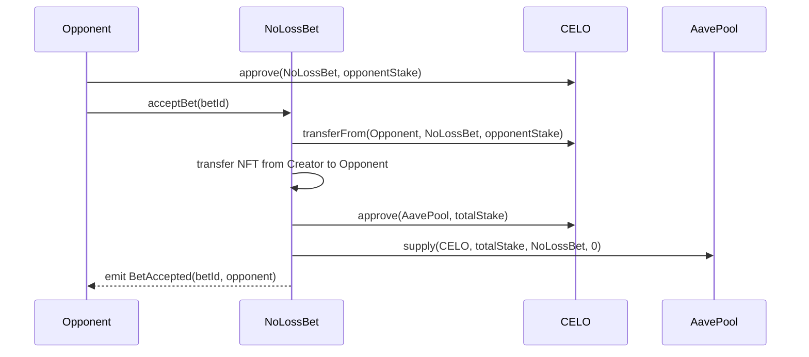
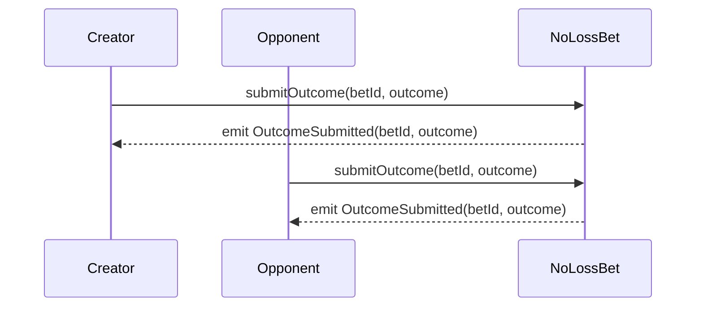
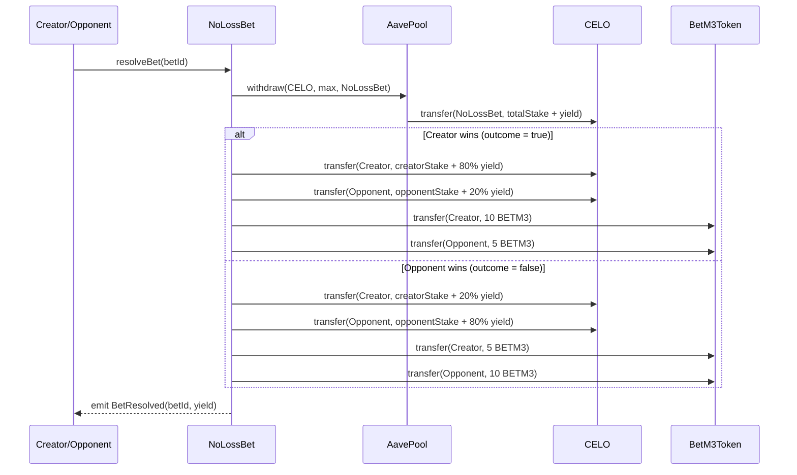
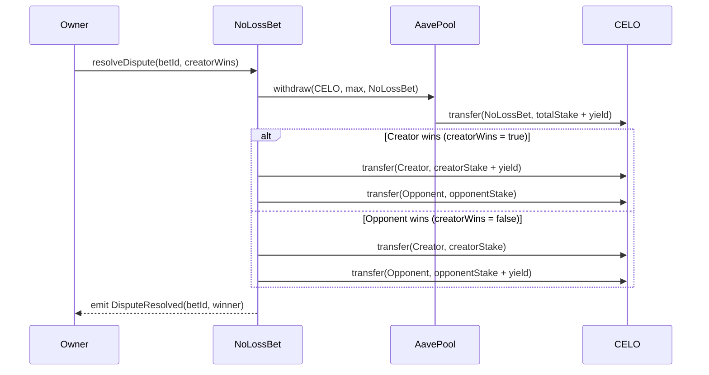

# NoLossBet Smart Contract Flow

## Overview

The NoLossBet system enables users to place bets without risk of loss by depositing stakes into Aave and using the generated yield to reward winners. The main components of the system are:

1. **NoLossBet Contract**: The main contract implementing the betting functionality
2. **BetM3Token**: An ERC20 token for rewards and governance
3. **AavePoolMock**: A mock for the Aave pool to simulate yields (in production, the real Aave pool would be used)

## Contract Flow

### 1. Creating a Bet

1. The creator approves the NoLossBet contract to transfer 100 CELO tokens
2. The creator calls `createBet()` specifying the desired opponent stake, condition, and a tokenURI for the NFT
3. The NoLossBet contract transfers 100 CELO from the creator
4. The NoLossBet contract mints an NFT to the creator representing the bet
5. A `BetCreated` event is emitted

### 2. Accepting a Bet

1. The opponent approves the NoLossBet contract to transfer the required stake
2. The opponent calls `acceptBet()` with the bet ID
3. The NoLossBet contract transfers the stake from the opponent
4. The NFT is transferred from the creator to the opponent
5. The total stake (creator + opponent) is deposited into the Aave pool to generate yield
6. A `BetAccepted` event is emitted

### 3. Submitting Outcomes

1. Both creator and opponent submit their outcomes (true = creator wins, false = opponent wins)
2. For each submission, an `OutcomeSubmitted` event is emitted

### 4a. Resolving the Bet (Matching Outcomes)

1. If both participants submitted the same outcome, either of them can resolve the bet
2. The NoLossBet contract withdraws all funds from the Aave pool (stake + yield)
3. The stakes are returned to their respective owners
4. The yield is split (80% to the winner, 20% to the loser)
5. BetM3 tokens are distributed as additional rewards (10 for the winner, 5 for the loser)
6. A `BetResolved` event is emitted

### 4b. Dispute Resolution (Non-matching Outcomes)

1. If participants submitted different outcomes, only the contract owner can resolve the dispute
2. The owner decides who wins (true = creator, false = opponent)
3. The NoLossBet contract withdraws all funds from the Aave pool
4. The stakes are returned to their respective owners
5. All the yield goes to the winner determined by the owner
6. A `DisputeResolved` event is emitted

## Tokenomics

### CELO Token
- Used as the stake for bets
- Deposited into Aave to generate yield
- Stakes are always refunded, only the yield is distributed

### BetM3 Token
- Distributed as additional rewards for participating in bets
- 10 tokens for the winner, 5 tokens for the loser
- Can be funded into the community pool by the owner

## Security Features

1. **No Loss**: Participants always get at least their original stake back
2. **NFT Representation**: Each bet is represented by an NFT that tracks ownership
3. **Dispute Resolution**: The owner can intervene in case of disagreements
4. **Transparent Outcomes**: All actions are documented through events on the blockchain

## Deployment Flow

1. Deploy BetM3Token
2. Deploy AavePoolMock (or use the address of the real Aave pool in production)
3. Deploy NoLossBet with the addresses of CELO, BetM3Token, and AavePool
4. Fund the community pool of the NoLossBet contract with BetM3Token 