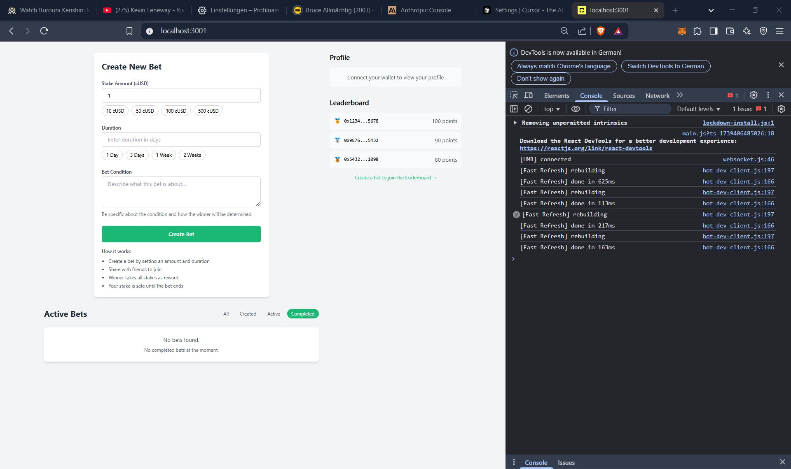
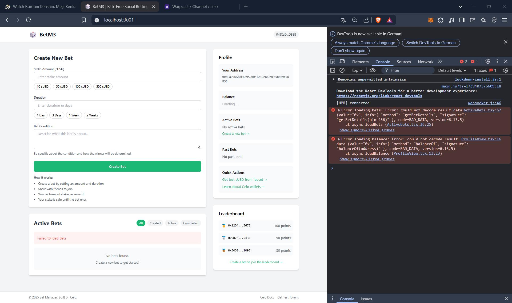

# BetM3 - Risk-Free Social Betting on Celo

BetM3 is a decentralized betting platform built on Celo that combines social betting with yield generation. Create and join bets with friends while your stakes generate yield through Ubeswap integration.

## Features

- 🎲 **Risk-Free Betting**: All stakes are preserved through yield generation
- 🏆 **Winner Takes Yield**: Winners earn rewards from generated yield
- 👥 **Social Betting**: Create and join bets with friends
- 📈 **Yield Generation**: Stakes earn yield through Ubeswap
- 🔒 **Secure**: Built on Celo blockchain with smart contract security

## Screenshots

### Before Wallet Connection


### After Wallet Connection


## Quick Start

1. Clone the repository:
```bash
git clone https://github.com/Gracing47/BetM3.git
cd BetM3
```

2. Install dependencies:
```bash
cd packages/react-app
npm install
```

3. Start the development server:
```bash
npm run dev
```

4. Open [http://localhost:3000](http://localhost:3000) in your browser

## Smart Contracts

- SimpleBetManager: `0x910273a1E3396e728CDe8B0748Fe1C0A36501BDA`
- cUSD Token: `0x765DE816845861e75A25fCA122bb6898B8B1282a`

## How It Works

1. **Create a Bet**
   - Set stake amount in cUSD
   - Define bet duration
   - Specify bet condition
   - Share with friends

2. **Join a Bet**
   - Connect your wallet
   - Approve token spending
   - Join existing bets
   - Track your stakes

3. **Earn Rewards**
   - Stakes generate yield
   - Winners earn rewards
   - Everyone keeps their stake
   - No risk of losing principal

## Development

### Project Structure
```
packages/
├── hardhat/          # Smart contracts and tests
└── react-app/        # Frontend application
    ├── components/   # React components
    ├── contexts/     # Web3 and app contexts
    ├── pages/        # Next.js pages
    └── utils/        # Utility functions
```

### Technologies Used
- Next.js + TypeScript
- Tailwind CSS
- ethers.js v6
- Hardhat
- Celo SDK

## Contributing

1. Fork the repository
2. Create your feature branch (`git checkout -b feature/amazing-feature`)
3. Commit your changes (`git commit -m 'Add some amazing feature'`)
4. Push to the branch (`git push origin feature/amazing-feature`)
5. Open a Pull Request

## Resources

- [Documentation](/team)
- [Celo Developer Resources](https://docs.celo.org/)
- [Ubeswap Documentation](https://docs.ubeswap.io/)

## Contact

- Project Updates: [Warpcast](https://warpcast.com/gracify)
- Technical Support: [GitHub Issues](https://github.com/Gracing47/BetM3/issues)

## License

This project is licensed under the MIT License - see the [LICENSE](LICENSE) file for details.
